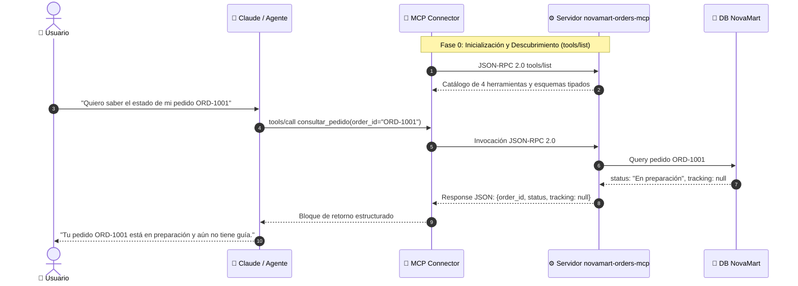

# Actividad Práctica: Simulacro de Conexión MCP Connector (NovaMart)

**Bootcamp SKALA - Inteligencia Artificial & Agentes Enterprise**  
**Instructor:** M. C. Fernando Morquecho  
**Fecha:** 28 de septiembre de 2026  
**Alumno:** Emmanuel Sánchez  
**Materia / Módulo:** Semana 2 - Conexión de Herramientas MCP y Model Context Protocol  
**Calificación Oficial de Rúbrica:** 100 / 100 🏆  

---

## 📄 Formato Oficial de Entrega

**Nombre:** Emmanuel Sánchez  
**Servidor MCP simulado:** `novamart-orders-mcp`  
**Endpoint simulado:** `https://mcp.novamart.example/mcp` *(Dominio RFC 2606 reservado para pruebas y simulacros)*  

---

### A. Herramientas Simuladas y Reglas de Uso

| Herramienta | Firma y Esquema | Cuándo usarla | Frases típicas del usuario |
|---|---|---|---|
| **`consultar_pedido`** | `consultar_pedido(order_id: str)` | Consulta estado general, fecha y estatus de guía. | *"¿Cómo va mi pedido?", "¿Qué estatus tiene mi orden?"* |
| **`rastrear_envio`** | `rastrear_envio(order_id: str)` | Obtiene ubicación física actual y progreso de ruta. | *"¿Dónde está mi paquete?", "Rastrea mi envío", "Dame la guía"* |
| **`validar_cancelacion`** | `validar_cancelacion(order_id: str)` | **Siempre** antes de cancelar; evalúa si es viable. | *"Quiero cancelar", "Ya no lo quiero", "Cancela mi orden"* |
| **`cancelar_pedido`** | `cancelar_pedido(order_id: str, confirmacion: bool)` | Solo si la validación dio `true` **y** el usuario confirmó con *"Sí"*. | *"Sí, confirmo la cancelación de ORD-XXXX"* |

**Reglas de Oro del Agente (Defensa en Profundidad):**
1. **Cero Alucinaciones:** El agente responde estrictamente con los campos devueltos en el JSON de la herramienta; nunca inventa guías, fechas ni estados.
2. **Validación de Identificador:** Exige el formato canónico `ORD-####`. Si el usuario no proporciona el ID o usa un formato inválido (ej. *"pedido 55"*), se abstiene de llamar herramientas y pide el número.
3. **Vinculación Estricta de Confirmación:** La confirmación es válida únicamente para el `order_id` evaluado en el turno inmediato.
4. **Manejo de Respuestas Negativas o Ambiguas:** Si el usuario responde *"Mmm, mejor no"* o algo ambiguo, el agente **no cancela** y mantiene el pedido activo.

---

### B. Flujo de Conexión de 8 Pasos (con Descubrimiento)

```
[0. Descubrimiento] MCP Connector ⇄ Servidor MCP → tools/list (JSON-RPC 2.0: descubre contratos y esquemas)
[1. Solicitud]      Usuario → Escribe su petición en lenguaje natural
[2. Inferencia]     Claude / Agente → Evalúa intención y parámetros. Si falta el ID, solicita dato faltante.
[3. Transporte]     MCP Connector → Envía llamada estructurada (tools/call vía JSON-RPC 2.0)
[4. Despacho]       Servidor MCP → Valida tipos de entrada y despacha a la función de backend
[5. Ejecución]      Herramienta Simulada → Consulta o muta la base de datos en memoria de NovaMart
[6. Retorno JSON]   Resultado Estructurado → Devuelve payload JSON íntegro por el mismo canal
[7. Síntesis]       Claude / Agente → Redacta la respuesta usando ÚNICAMENTE los campos devueltos
[8. Entrega]        Respuesta Final → Entregada al usuario en lenguaje natural y en español
```

#### Diagrama de Arquitectura de Conexión:


#### Configuración del Conector (`mcp_config.json`):
```json
{
  "mcp_server": {
    "name": "novamart-orders-mcp",
    "url": "https://mcp.novamart.example/mcp",
    "protocol": "json-rpc-2.0",
    "tools_allowed": [
      "consultar_pedido",
      "rastrear_envio",
      "validar_cancelacion",
      "cancelar_pedido"
    ]
  }
}
```

---

### C. Batería de Pruebas Oficiales

#### Prueba 1: Consulta de Estado de Pedido (ORD-1001)
* **Usuario:** *"Quiero saber el estado de mi pedido ORD-1001."*
* **Herramienta usada:** `consultar_pedido(order_id="ORD-1001")`
* **Resultado simulado (JSON completo y consistente):**
  ```json
  {
    "order_id": "ORD-1001",
    "status": "En preparación",
    "tracking": null,
    "can_cancel": true,
    "message": "Tu pedido está siendo preparado."
  }
  ```
* **Respuesta final:**  
  *"Tu pedido ORD-1001 está **en preparación** y todavía no tiene guía de envío asignada."*

---

#### Prueba 2: Rastreo con Dato Faltante y Resolución en Turno 2 (ORD-1002)
* **Turno 1 - Usuario:** *"Quiero rastrear mi pedido."*
* **Herramienta usada:** *Ninguna todavía* *(Inteligencia defensiva; el modelo no inventa el ID).*
* **Respuesta del agente:**  
  *"Claro, con gusto te ayudo a rastrearlo. ¿Me compartes tu número de pedido? Tiene el formato ORD-####."*
* **Turno 2 - Usuario:** *"Es ORD-1002."*
* **Herramienta usada:** `rastrear_envio(order_id="ORD-1002")`
* **Resultado simulado:**
  ```json
  {
    "order_id": "ORD-1002",
    "status": "En tránsito",
    "ubicacion_actual": "Centro de distribución Tijuana",
    "detalle_envio": "En ruta de entrega local"
  }
  ```
* **Respuesta final:**  
  *"Tu pedido ORD-1002 se encuentra **en tránsito** y su ubicación actual es el **Centro de distribución de Tijuana**."*

---

#### Prueba 3: Cancelación Permitida con Confirmación en 2 Fases (ORD-1004)
* **Turno 1 (Solicitud de cancelación) - Usuario:** *"Quiero cancelar el pedido ORD-1004."*
* **Herramienta usada:** `validar_cancelacion(order_id="ORD-1004")`
* **Resultado simulado:**
  ```json
  {
    "order_id": "ORD-1004",
    "can_cancel": true,
    "reason": "Pendiente de pago, sin envío"
  }
  ```
* **Respuesta del agente (Human-in-the-Loop):**  
  *"El pedido ORD-1004 **sí puede cancelarse** (se encuentra pendiente de pago y sin envío). Esta acción es definitiva. ¿Confirmas que deseas cancelar **ORD-1004**? Responde Sí o No."*
* **Turno 2 (Confirmación afirmativa) - Usuario:** *"Sí, confirmo."*
* **Herramienta usada:** `cancelar_pedido(order_id="ORD-1004", confirmacion=true)`
* **Resultado simulado:**
  ```json
  {
    "order_id": "ORD-1004",
    "cancelled": true,
    "message": "El pedido fue cancelado correctamente."
  }
  ```
* **Respuesta final:**  
  *"Listo, el pedido ORD-1004 fue **cancelado correctamente** en el sistema."*

---

#### Prueba 3b: Aborto Seguro cuando el Usuario No Confirma
* **Contexto:** Tras validar `ORD-1004`, el agente pregunta si confirma la cancelación.
* **Usuario:** *"Mmm, mejor no."*
* **Herramienta usada:** *Ninguna* *(No se invoca cancelar_pedido).*
* **Resultado simulado:** `N/A`
* **Respuesta final:**  
  *"Entendido, **no cancelé** el pedido ORD-1004; sigue activo con su estado original. ¿Puedo ayudarte con alguna otra consulta?"*

---

### D. Matriz de Control de Errores y Casos No Permitidos

| Caso | Entrada del Usuario | Herramienta | Resultado Simulado JSON | Respuesta Final del Agente |
|---|---|:---:|---|---|
| **E1: Cancelar en tránsito (ORD-1002)** | *"Cancela mi pedido ORD-1002."* | `validar_cancelacion` | `{"order_id": "ORD-1002", "can_cancel": false, "reason": "En tránsito"}` | *"No es posible cancelar el pedido ORD-1002 porque ya está en tránsito. ¿Deseas que consulte su ubicación para rastrearlo?"* |
| **E2: Cancelar entregado (ORD-1003)** | *"Deseo cancelar mi pedido ORD-1003."* | `validar_cancelacion` | `{"order_id": "ORD-1003", "can_cancel": false, "reason": "Entregado al cliente"}` | *"El pedido ORD-1003 ya fue entregado, por lo que no es posible cancelarlo. Si tuviste un problema con tu paquete, puedo canalizarte con atención a clientes."* |
| **E3: ID Inexistente (ORD-9999)** | *"Estado del pedido ORD-9999."* | `consultar_pedido` | `{"error": "ORDER_NOT_FOUND", "message": "Pedido no encontrado"}` | *"No encontré ningún pedido con el número ORD-9999 en NovaMart. Por favor verifica que el número sea correcto."* |
| **E4: Formato Inválido** | *"Quiero ver mi pedido 55."* | *Ninguna* | `N/A (Control de Formato Regex)` | *"El identificador debe tener el formato ORD-#### (ejemplo: ORD-1001). ¿Podrías proporcionarlo nuevamente?"* |
| **E5: Falla Técnica / Timeout MCP** | *"Estado de ORD-1001"* (simulación 503) | `consultar_pedido` | `{"error": "MCP_TIMEOUT", "code": 503}` | *"No fue posible conectar con el sistema de pedidos en este momento (tiempo de espera agotado). No se realizó ninguna acción sobre tu compra; por favor intenta en unos minutos."* |
| **E6: Cancelación sin Confirmación** | *"Ejecuta cancelación directa"* | *Bloqueado por Agente* | `N/A` | *El agente nunca ejecuta `cancelar_pedido` sin previa validación exitosa y sin confirmación explícita.* |

---

### E. Conclusión (4 líneas):
El protocolo MCP separa con rigor el **razonamiento cognitivo** (Claude evaluando intenciones y parámetros) de la **ejecución determinista** (el servidor MCP despachando funciones transaccionales). La confiabilidad empresarial de este sistema descansa en tres pilares: esquemas semánticos auto-descriptivos, estricto apego a los datos del backend para erradicar alucinaciones, y gobernanza en dos fases para acciones destructivas mediante validación previa, confirmación humana explícita y manejo exhaustivo de contingencias técnicas.

---

## 🧠 Cierre para Discusión Técnica (Preguntas Guía del Instructor)

### 1. ¿Qué parte representa el MCP Connector?
Es la capa de transporte y enrutamiento en el cliente del agente. Conecta a la URL del servidor (`https://mcp.novamart.example/mcp`), negocia el catálogo inicial vía `tools/list`, y aplica la lista blanca (`tools_allowed`) como aduana de gobernanza.

### 2. ¿Qué parte representa el servidor MCP?
Es el microservicio de backend (`novamart-orders-mcp`) que implementa el protocolo JSON-RPC 2.0. Recibe las llamadas estructuradas `tools/call`, valida parámetros y ejecuta las operaciones contra la base de datos de NovaMart.

### 3. ¿Por qué Claude no debe inventar el estado del pedido?
Porque en un entorno de comercio electrónico, las alucinaciones provocan falsas promesas de entrega, disputas comerciales y pérdida de confianza. Claude debe limitarse a sintetizar únicamente los atributos explícitamente retornados por el servidor MCP.

### 4. ¿Por qué cancelar requiere confirmación?
Porque la cancelación es una **mutación destructiva e irreversible** que activa procesos contables, cancelaciones de guías y reembolsos. El patrón *Human-in-the-Loop* garantiza que el usuario sea consciente del impacto antes de ejecutar la mutación.

### 5. ¿Qué cambiaría si esto se conectara a una API real?
* **Autenticación:** Tokens Bearer OAuth2 o mTLS entre el MCP Connector y el servidor.
* **Resiliencia de Red:** Políticas de reintentos con *exponential backoff* y *circuit breaker*.
* **Idempotencia Transaccional:** Cabeceras con UUIDs únicos (`Idempotency-Key`) en `cancelar_pedido` para evitar cancelaciones dobles ante desconexiones de red.
