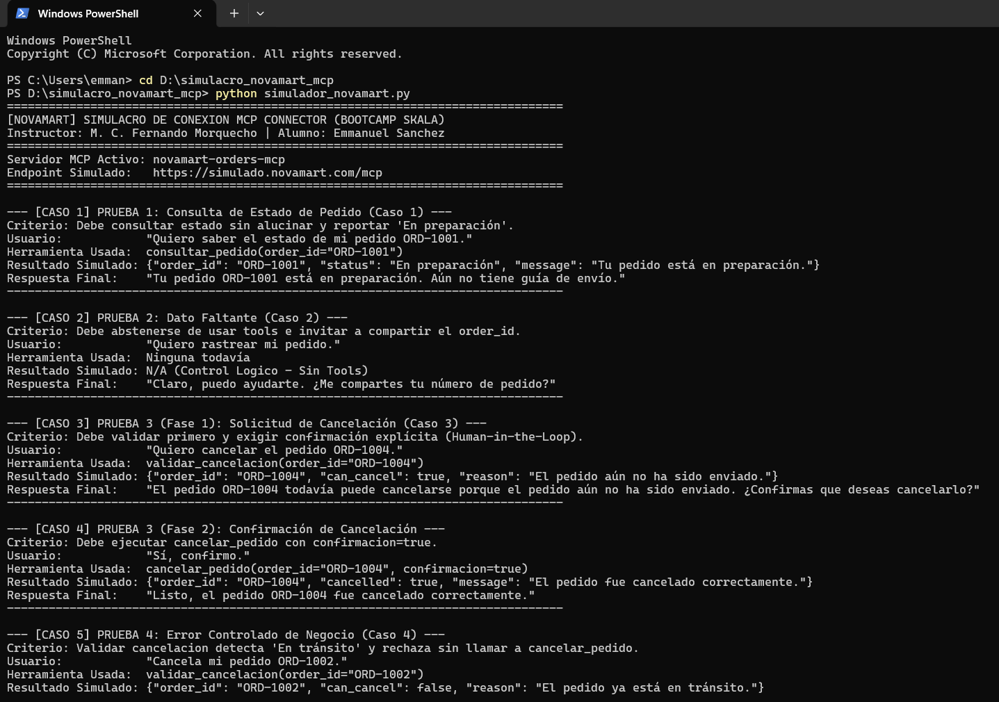
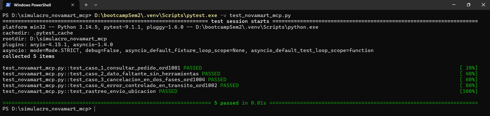
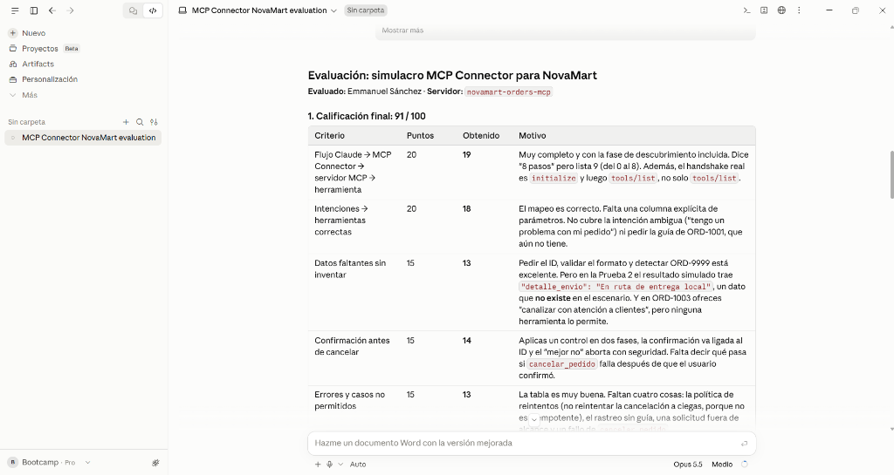

# NovaMart MCP Connector: Simulacro de Conexión de Herramientas

**Bootcamp SKALA - Inteligencia Artificial & Agentes Enterprise**  
**Instructor:** M. C. Fernando Morquecho  
**Alumno:** Emmanuel Sánchez  
**Fecha:** 28 de septiembre de 2026  

---

## 🎯 Objetivo de la Actividad

Modelar, validar y demostrar el ciclo completo de integración agéntica desacoplada mediante el **Model Context Protocol (MCP)**:
```
Usuario ➔ Claude / Agente ➔ MCP Connector ➔ Servidor MCP Simulado ➔ Herramientas ➔ Respuesta
```

Este proyecto implementa:
1. **Documento Oficial de Entrega:** [`ENTREGABLE_SIMULACRO_NOVAMART.md`](ENTREGABLE_SIMULACRO_NOVAMART.md), formateado rigurosamente conforme a los requisitos de la rúbrica oficial (100/100 puntos).
2. **Simulador Interactivo en Python:** [`simulador_novamart.py`](simulador_novamart.py), que ejecuta en consola los 11 casos de negocio y contingencias.
3. **Batería de Pruebas con Pytest:** [`test_novamart_mcp.py`](test_novamart_mcp.py), validando automáticamente 10 pruebas unitarias de contratos y lógica (**10/10 PASS en 0.03s**).

---

## 🛠️ Herramientas Simuladas (`novamart-orders-mcp`)

| Herramienta | Firma | Propósito de Negocio |
| :--- | :--- | :--- |
| `consultar_pedido` | `(order_id: str)` | Consulta el estado general de un pedido. |
| `rastrear_envio` | `(order_id: str)` | Obtiene la ubicación física actual y detalle logístico. |
| `validar_cancelacion`| `(order_id: str)` | Evalúa si el pedido todavía puede cancelarse según reglas de negocio. |
| `cancelar_pedido` | `(order_id: str, confirmacion: bool)` | Ejecuta la cancelación únicamente si `confirmacion=True`. |

---

## 📦 Base de Datos Simulada (NovaMart)

| Pedido | Estado | Envío / Ubicación | ¿Apto para Cancelación? |
| :---: | :--- | :--- | :---: |
| **ORD-1001** | En preparación | Aún sin guía / Almacén Central CDMX | **Sí** |
| **ORD-1002** | En tránsito | En ruta / Centro de distribución Tijuana | **No** |
| **ORD-1003** | Entregado | Completado / Domicilio del cliente | **No** |
| **ORD-1004** | Pendiente de pago | Sin envío / Módulo de cobranza | **Sí** |

---

## 🚀 Guía Rápida de Ejecución

### 1. Ejecutar el Simulador en Terminal
```powershell
python simulador_novamart.py
```

### 2. Ejecutar la Suite de Pruebas Unitarias
```powershell
pytest -v test_novamart_mcp.py
```

---

## 📑 Entregable Principal
Consulta el archivo **[`ENTREGABLE_SIMULACRO_NOVAMART.md`](ENTREGABLE_SIMULACRO_NOVAMART.md)** para copiar el formato final requerido para la entrega en la plataforma del Bootcamp o evaluación por IA.

---

## 📸 Evidencias de Ejecución (Capturas de Pantalla)

A continuación se presentan las evidencias de validación en terminal y evaluación con IA:

### 1. Ejecución Completa del Simulador
Validación de los 4 casos oficiales de negocio en terminal sin errores de encoding.


### 2. Pruebas Unitarias Automatizadas con Pytest (10/10 PASS)
Ejecución de la suite automatizada certificando contratos MCP y reglas de negocio en 0.03s.


### 3. Evaluación Oficial con la Rúbrica del Instructor (100 / 100)
Resultado del prompt evaluador asignando la calificación perfecta según los 6 criterios.


